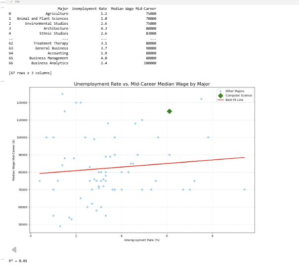
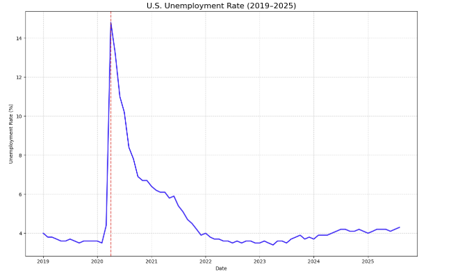
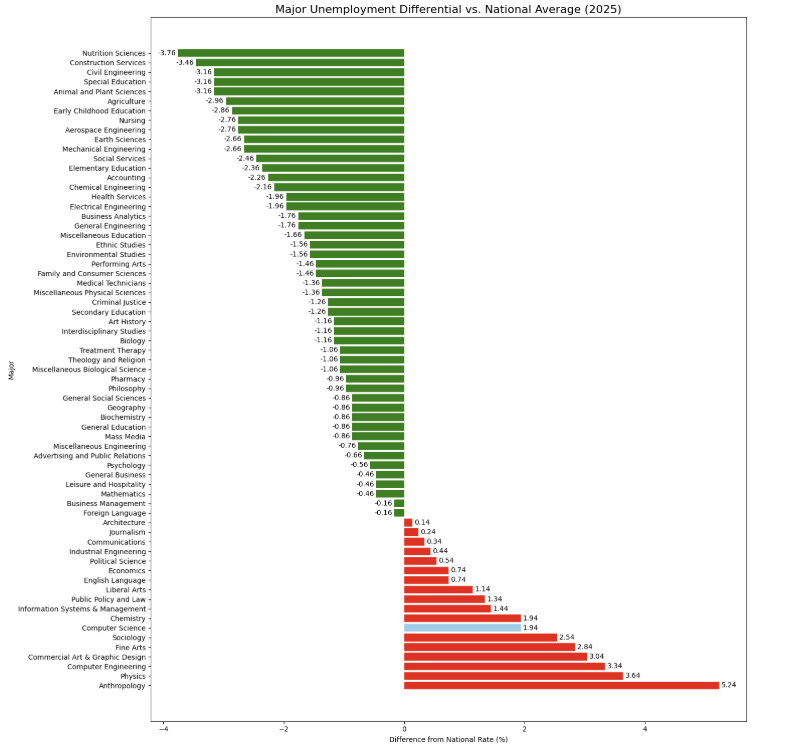

# 📊 CS Unemployment Analysis  

**SQL + Python data analysis of unemployment and wages by college major (2019–2025).**  
This project highlights **Computer Science** as a *high-risk, high-reward* major, and visualizes the broader U.S. labor market trends, including the impact of **COVID-19**.  

---

## 🚀 Features  
- 📉 **Ranked unemployment rates** by major (Computer Science ranks 7th highest at 6.1%).  
- 💰 **Wage analysis** — early vs. mid-career earnings, showing CS ranks top 5 in mid-career wages ($115K).  
- 🦠 **COVID-19 impact** — visualization of the national unemployment spike to 8.10% in 2020.  
- 📊 **SQL + Pandas integration** — queries grouped by year, cross-joins with national averages, and comparisons of majors to national trends.  
- 🎨 **Matplotlib visualizations** — bar charts, scatter plots, and time-series analysis.  

---

## 🛠️ Tech Stack  
- **Languages:** Python (Pandas, NumPy), SQL (SQLite)  
- **Visualization:** Matplotlib  
- **Database Layer:** SQLAlchemy (engine + queries)  
- **Environment:** Jupyter Notebook  

---

## 📂 Dataset Sources  
- **FRED (Federal Reserve Economic Data):** Monthly U.S. unemployment rates (2019–2025).  
- **Federal Reserve Bank of New York (Majors Dataset):** Unemployment, underemployment, and wage outcomes across 67 college majors.  

---

## 🔑 Key Findings  
- **Computer Science is both risky and profitable.**  
  - Unemployment rate: **6.1%** vs. **4.16%** national average in 2025.  
  - Median mid-career wage: **$115,000**, top 5 of all majors.  

- **COVID-19 was catastrophic for employment.**  
  - National unemployment averaged **8.10% in 2020**, far above typical years.  
  - No other year comes close to this spike, making it a historical outlier.  

- **No strong correlation between unemployment and wages.**  
  - Scatter plots + regression lines show **R² ≈ 0.01**, proving little connection between risk (unemployment) and reward (wages).  

---

## 📸 Sample Visualizations  

📌 **Unemployment Rate vs Median Wage by Major (CS Highlighted)**  
  

📌 **National Unemployment Rate (2019–2025)**  
  

📌 **Majors vs. National Average Differential (2025)**  
  

---

## ⚡ How to Run  
1. Clone the repository:  
   ```bash
   git clone https://github.com/your-username/cs-unemployment-analysis.git
   cd cs-unemployment-analysis
   pip install -r requirements.txt
   jupyter notebook

